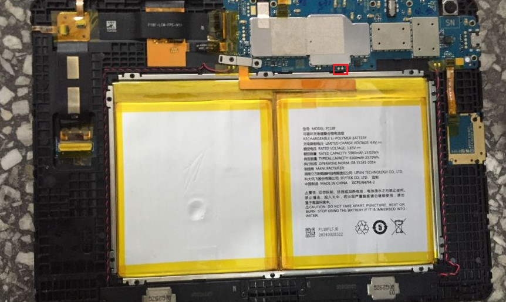

X1 PRO - 研究导航 - 小白向  
====
Welcome!  
网站：[X1 PRO - 研究导航 - 小白向](https://supersuroot.github.io)  

  

----------------------------------------------------------------------------------------------------------------------------------------

## 1.其他机型 TB-8X04F
   链接： [勇士，欢迎你来到讯飞平板资源下载站](https://magisk-root.github.io/ "TB-8X04F")    
   
## 2.X1 PRO - 9008
   ~~链接：[百度网盘：X1 PRO](https://pan.baidu.com/s/1lLg5ZdjAx-zJB3AGqwAuMA/ "X1 PRO") `提取码：9008 `  
   `解压密码：IFlyTekAiStudy2020`（文件内有刷机教程）~~  
   文本教程：[X1 PRO-wiki_github](https://github.com/SupersuROOT/supersuroot.github.io/wiki)  
   修改镜像下载：[system_修改镜像-Github](https://github.com/SupersuROOT/supersuroot.github.io/releases)  
   提取分区镜像文件教程：[重磅干货！高通9008模式与数据提取](https://zhuanlan.zhihu.com/p/35422254)    
   （选择分区时一定要用右边的滑栏！鼠标滚动容易找漏！）  
   补：由于X1 PRO支持gsi，所以可尝试使用gsi（通用系统镜像）进行刷机。  
   注：**9008模式仅可用于尚支持9008的X1 PRO机型**，若9008模式从上述方法进不去，可尝试拆机并短接如下两点（见下图）  
       
###### _X1 PRO拆机图（图片由友情人士提供）_
   
## 3.部分总结经验（X1 PRO)
* Q:Windows环境下怎么解包bin格式的分区镜像？  
  A:很简单，BIN格式的文件实际上就是img镜像文件，可通过[DNA:安卓ROM解包打包工具](https://gitee.com/sharpeter/DNA "DNA")解包修改    
* Q:我需要备份什么？各分区具体有什么作用？  
  A:通常情况下，你可以备份system、boot、recovery、~~userdata~~分区（讯飞默认加密userdata分区，恢复出厂后userdata的备份失效）  
    各分区作用：[Android系统分区理解及分区目录细解【转】](https://www.cnblogs.com/zzb-Dream-90Time/p/10160930.html)  
* Q:第三方REC有吗？  
  A:无，我们建议使用同CPU的机型的第三方recovery（如TWRP）进行移植;如果您有足够的技术力的话，也可以通过device tree来手动编译一个TWRP。
* Q:9008通过按键进不去，还有其他方法吗？  
  A:见文本教程[X1 PRO-wiki_github](https://github.com/SupersuROOT/supersuroot.github.io/wiki)  
  
## 4.最后  
   其实我不太相信有人会通过github来找教程，    
   但若果你看到这了，请一定不要忽视上面的成果，您可以把任何建议提交到issues当中  
   还有，如果您有任何其他的发现或建议，请`务必`提交issues或联系我  
   
## 5.联系方式  
   邮箱：SuperSU-ROOT@outlook.com  
   加入讨论：[Github_讨论](https://github.com/SupersuROOT/supersuroot.github.io/discussions "讨论")  
   
   
## 免责声明  
   本项目一切均来自网络，本人只提供收集，任何责任均与本人无关！！！    
   

     
     

